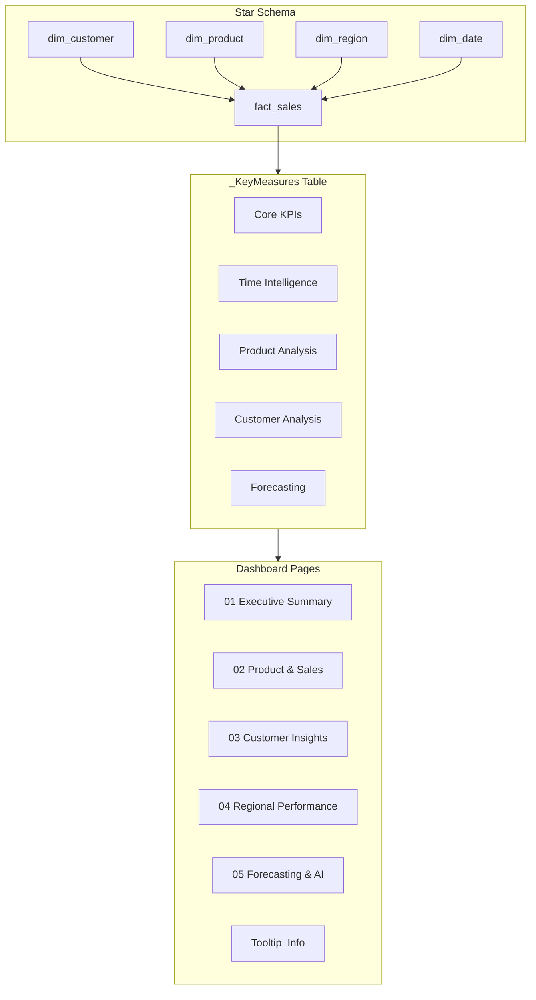

# 📊 AI-Powered Sales Forecasting Dashboard — PBIX Report

> Complete technical and functional documentation of the `AI_Powered_Sales_Forecasting.pbix` Power BI dashboard, auto-generated from the PBIX file structure.

---

## 📋 Dashboard Overview

| Property | Detail |
|---|---|
| **File** | `AI_Powered_Sales_Forecasting.pbix` |
| **Canvas Size** | 1280 × 720 px (Standard 16:9) |
| **Total Pages** | 6 (5 interactive + 1 tooltip) |
| **Total Visuals** | 105 elements across all pages |
| **Data Model** | Star Schema (fact_sales → dim_customer, dim_product, dim_region, dim_date) |
| **Measure Table** | `_KeyMeasures` (disconnected table holding all DAX measures) |
| **Theme** | Corporate Light — Primary `#003B73`, Secondary `#0074B7`, Success `#27AE60`, Alert `#BF212F` |

### Global Filters (Present on Every Page)
All 5 main pages share a synchronized filter bar in the top-right corner:

| Slicer | Data Field | Type |
|---|---|---|
| 📅 Year | `dim_date[year]` | Dropdown |
| 📅 Quarter | `dim_date[quarter]` | Dropdown |
| 🌍 Market | `dim_region[market]` | Dropdown |

Each page also has an **info action button** (ℹ️) in the top-right corner that triggers the `Tooltip_Info` canvas.

---

## 📄 Page 1: Executive Summary

**Objective**: Provide a bird's-eye view of overall business health for C-level executives.

### Layout Blueprint

```
┌─────────────────────────────────────────────────────────────────────┐
│  [Logo]  ██ EXECUTIVE SUMMARY ██           [Year][Qtr][Market] [ℹ] │
├──────────┬──────────┬──────────┬──────────┬─────────────────────────┤
│ Revenue  │  Profit  │ Margin % │  Orders  │   YoY Growth %          │
│ (Card)   │  (Card)  │  (Card)  │  (Card)  │     (Card)              │
├──────────────────────────────────┬──────────────────────────────────┤
│                                  │                                  │
│  Revenue & Profit Trend          │  Revenue by Category             │
│  (Line + Clustered Column)       │  (Clustered Bar Chart)           │
│  X: Month  |  Col: Revenue       │  Y: Category                     │
│            |  Line: Profit       │  X: Revenue                      │
│                                  │                                  │
├─────────────────────┬────────────┴──────────────────────────────────┤
│                     │                                                │
│  Revenue by Market  │  Top Products by Revenue                       │
│  (Donut Chart)      │  (Clustered Bar Chart)                         │
│  Category: Market   │  Y: Product Name                               │
│  Value: Revenue     │  X: Revenue                                    │
│                     │                                                │
└─────────────────────┴────────────────────────────────────────────────┘
```

### Visual Inventory (20 Elements)

| # | Type | Title / Purpose | Data Fields | Notes |
|---|---|---|---|---|
| 1 | **Text Box** | Page title "Executive Summary" | — | Header banner |
| 2 | **Card** | Total Revenue | `_KeyMeasures.Revenue` | Accent bar, icon |
| 3 | **Card** | Total Profit | `_KeyMeasures.Profit` | Glow effect |
| 4 | **Card** | YoY Growth % | `_KeyMeasures.YoY Growth %` | Label formatted |
| 5 | **Line + Column Combo** | Revenue & Profit Trend | X: `dim_date.month_name_short`, Col: `Revenue`, Line: `Profit` | Dual axis; markers enabled |
| 6 | **Donut Chart** | Revenue by Market | Category: `dim_region.market`, Value: `Revenue` | Shows 7-market split |
| 7 | **Clustered Bar** | Revenue by Category | Y: `dim_product.category`, X: `Revenue` | 3 categories compared |
| 8 | **Clustered Bar** | Top Products by Revenue | Y: `dim_product.product_name`, X: `Revenue` | Scrollable product list |
| 9–11 | **Slicers** (×3) | Year / Quarter / Market | `dim_date.year`, `dim_date.quarter`, `dim_region.market` | Synced across pages |
| 12 | **Action Button** | Info tooltip trigger | — | Opens Tooltip_Info page |
| 13 | **Card (Blank)** | Info icon overlay | `_KeyMeasures.Blank` | Custom styled |
| 14 | **Card** | Profit Margin % | `_KeyMeasures.Profit Margin %` | Icon formatted |
| 15 | **Card** | Total Orders | `_KeyMeasures.Orders` | Spacing formatted |
| 16–19 | **Images** (×4) | Logo + slicer icons | — | Branding assets |
| 20 | **Shape** | Decorative divider | — | Rotated separator |

---

## 📄 Page 2: Product & Sales Analysis

**Objective**: Evaluate product performance, pricing effectiveness, discount impact, and category profitability.

### Layout Blueprint

```
┌─────────────────────────────────────────────────────────────────────┐
│  [Logo]  ██ PRODUCT & SALES ANALYSIS ██    [Year][Qtr][Market] [ℹ] │
├──────────────┬──────────────┬──────────────┬────────────────────────┤
│ Avg Order    │ Quantity     │ Avg Discount │   Total Products       │
│ Value (Card) │ Sold (Card)  │ % (Card)     │     (Card)             │
├──────────────────────────────┬──────────────────────────────────────┤
│                              │                                      │
│  Discount vs Profitability   │  Top 10 Products                     │
│  (Stacked Column Chart)      │  (Clustered Bar Chart)               │
│  X: Month | Series: Category │  Y: Product Name                     │
│  Y: Revenue                  │  X: Revenue                          │
│                              │                                      │
├──────────────────────────────┬──────────────────────────────────────┤
│                              │                                      │
│  Category × Sub-Category     │  Bottom 10 Products                  │
│  Matrix (Pivot Table)        │  (Clustered Bar Chart)               │
│  Rows: Category → SubCat     │  Y: Product Name                     │
│  Values: Orders, Qty,        │  X: Profit (negative highlighted)    │
│    Revenue, Profit, Margin % │                                      │
├──────────────────────────────┴──────────────────────────────────────┤
│ [Top Category Insight]  [Highest Margin Insight]  [Lowest Category] │
│       (Insight Cards ×3 — dynamic text measures)                    │
└─────────────────────────────────────────────────────────────────────┘
```

### Visual Inventory (22 Elements)

| # | Type | Title / Purpose | Data Fields | Notes |
|---|---|---|---|---|
| 1 | **Text Box** | Page title | — | Header banner |
| 2 | **Card** | Avg Order Value | `_KeyMeasures.Avg Order Value` | With icon |
| 3 | **Card** | Quantity Sold | `_KeyMeasures.Quantity Sold` | — |
| 4 | **Card** | Avg Discount | `_KeyMeasures.Avg Discount` | Percentage format |
| 5 | **Card** | Total Products | `_KeyMeasures.Total Products` | — |
| 6 | **Clustered Bar** | Bottom 10 Products | Y: `product_name`, X: `Profit` | Negative values in red |
| 7 | **Action Button** | Info tooltip | — | Opens Tooltip_Info |
| 8 | **Card (Blank)** | Info overlay | `_KeyMeasures.Blank` | Styled |
| 9 | **Stacked Column** | Discount vs Profitability | X: `month_name`, Series: `category`, Y: `Revenue` | Category breakdown by month |
| 10 | **Clustered Bar** | Top 10 Products | Y: `product_name`, X: `Revenue` | Ranked descending |
| 11 | **Pivot Table** | Category × Sub-Category Matrix | Rows: `category` → `sub_category`; Values: Orders, Qty, Revenue, Profit, Margin % | Expandable hierarchy |
| 12 | **Image** | Logo | — | — |
| 13 | **Card** | Top Category Insight | `_KeyMeasures.Top Category Insight` | Dynamic text measure |
| 14 | **Card** | Highest Margin Insight | `_KeyMeasures.Highest Margin Insight` | Dynamic text measure |
| 15 | **Card** | Lowest Category Insight | `_KeyMeasures.Lowest Category Insight` | Dynamic text measure |
| 16–18 | **Slicers** (×3) | Year / Quarter / Market | Synced | — |
| 19–21 | **Images** (×3) | Slicer icons | — | — |
| 22 | **Shape** | Decorative divider | — | — |

---

## 📄 Page 3: Customer Insights

**Objective**: Understand customer behavior, purchasing patterns, lifetime value, and churn risk indicators.

### Layout Blueprint

```
┌─────────────────────────────────────────────────────────────────────┐
│  [Logo]  ██ CUSTOMER INSIGHTS ██           [Year][Qtr][Market] [ℹ] │
├────────────────┬────────────────┬──────────────┬────────────────────┤
│ Customer Count │ Revenue per    │ Repeat       │ Repeat Purchase    │
│   (Card)       │ Country (Card) │ Buyers (Card)│   Rate (Card)      │
├─────────────────────┬─────────────────┬────────────────────────────┤
│                     │                 │                              │
│ Top 10 Customers    │ Revenue by      │ Customer Distribution        │
│ by Revenue          │ Segment         │   by Country                 │
│ (Clustered Bar)     │ (Donut Chart)   │ (Stacked Bar Chart)          │
│ Y: Customer Name    │ Cat: Segment    │ Y: Customer Count            │
│ X: Revenue          │ Val: Revenue    │ X: Country                   │
│                     │                 │ Series: Segment              │
├─────────────────────────────────┬──────────────────────────────────┤
│                                 │                                    │
│ Top 20 Customers Purchase       │ Churn Risk Customers               │
│ Frequency (Orders)              │   (Table)                          │
│ (Bar Chart)                     │ Cols: Name, Revenue, Orders,       │
│ Y: Customer Name                │   Last Purchase Date, Churn Status │
│ X: Orders                       │                                    │
│                                 │                                    │
└─────────────────────────────────┴──────────────────────────────────┘
```

### Visual Inventory (21 Elements)

| # | Type | Title / Purpose | Data Fields | Notes |
|---|---|---|---|---|
| 1 | **Card** | Customer Count | `_KeyMeasures.Customer Count` | — |
| 2 | **Card** | Revenue per Country | `_KeyMeasures.Revenue per Country` | — |
| 3 | **Card** | Repeat Buyers | `_KeyMeasures.Repeat Buyers` | — |
| 4 | **Card** | Repeat Purchase Rate | `_KeyMeasures.Repeat Purchase Rate` | Percentage format |
| 5 | **Stacked Bar** | Customer Distribution by Country | Y: `Customer Count`, X: `dim_region.country`, Series: `dim_customer.segment` | Segment color-coded |
| 6 | **Action Button** | Info tooltip | — | — |
| 7 | **Card (Blank)** | Info overlay | — | — |
| 8 | **Donut Chart** | Revenue by Customer Segment | Cat: `dim_customer.segment`, Val: `Revenue` | Consumer, Corporate, Home Office |
| 9 | **Clustered Bar** | Top 10 Customers by Revenue | Y: `Revenue`, X: `dim_customer.customer_name` | Top spenders |
| 10 | **Table** | Churn Risk Customers | `customer_name`, `Revenue`, `Orders`, `Last Purchase Date`, `Churn Status` | Conditional formatting on status |
| 11 | **Bar Chart** | Top 20 Purchase Frequency | Y: `dim_customer.customer_name`, X: `Orders` | Loyalty indicator |
| 12 | **Unknown** | Background element | — | Likely a container/group |
| 13 | **Image** | Logo | — | — |
| 14 | **Text Box** | Page title | — | — |
| 15–17 | **Slicers** (×3) | Year / Quarter / Market | Synced | — |
| 18–20 | **Images** (×3) | Slicer icons | — | — |
| 21 | **Shape** | Decorative divider | — | — |

---

## 📄 Page 4: Regional Performance

**Objective**: Analyze geographical performance across markets, regions, countries, and cities.

### Layout Blueprint

```
┌─────────────────────────────────────────────────────────────────────┐
│  [Logo]  ██ REGIONAL PERFORMANCE ██        [Year][Qtr][Market] [ℹ] │
├──────────┬────────┬──────────┬──────────┬──────────────────────────┤
│ Revenue  │ Profit │ Margin % │ Total    │ Total Cities             │
│ (Card)   │ (Card) │ (Card)   │Countries │   (Card)                 │
│          │        │          │ (Card)   │                          │
├─────────────────────────┬──────────────────┬───────────────────────┤
│                         │                  │                        │
│ Revenue by Market       │ Revenue by       │ Top 10 Countries       │
│ (Stacked Bar)           │ Region           │ (Clustered Bar)        │
│ Y: Market               │ (Stacked Bar)    │ Y: Country             │
│ X: Revenue              │ Y: Region        │ X: Revenue             │
│ Series: Category        │ X: Revenue       │                        │
│                         │ Series: Category │                        │
├──────────┬──────────────┴──────────────────┬───────────────────────┤
│ Regional │                                  │                       │
│ Matrix   │ Bubble Map                       │ Top 10 Cities         │
│ (Pivot)  │ Location: Country                │ (Clustered Bar)       │
│ Rows:    │ Series: Market                   │ Y: City               │
│ Market → │ Size: Revenue                    │ X: Revenue            │
│ Region → │                                  │                       │
│ Country  │                                  │                       │
└──────────┴──────────────────────────────────┴───────────────────────┘
```

### Visual Inventory (22 Elements)

| # | Type | Title / Purpose | Data Fields | Notes |
|---|---|---|---|---|
| 1 | **Card** | Profit Margin % | `_KeyMeasures.Profit Margin %` | — |
| 2 | **Card** | Total Countries | `_KeyMeasures.Total Countries` | — |
| 3 | **Action Button** | Info tooltip | — | — |
| 4 | **Card (Blank)** | Info overlay | — | — |
| 5 | **Stacked Bar** | Revenue by Market | Y: `dim_region.market`, Series: `dim_product.category`, X: `Revenue` | Category breakdown |
| 6 | **Clustered Bar** | Top 10 Countries | Y: `dim_region.country`, X: `Revenue` | Ranked |
| 7 | **Pivot Table** | Regional Performance Matrix | Rows: `market` → `region` → `country`; Values: Revenue, Profit, Margin % | 3-level drill-down |
| 8 | **Clustered Bar** | Top 10 Cities | Y: `dim_region.city`, X: `Revenue` | — |
| 9 | **Card** | Total Cities | `_KeyMeasures.Total Cities` | — |
| 10 | **Stacked Bar** | Revenue by Region | Y: `dim_region.region`, Series: `dim_product.category`, X: `Revenue` | Regional category split |
| 11 | **Bubble Map** | Geographic Revenue Map | Location: `country`, Series: `market`, Size: `Revenue` | Interactive; zoom-enabled |
| 12–14 | **Slicers** (×3) | Year / Quarter / Market | Synced | — |
| 15–17 | **Images** (×3) | Slicer icons | — | — |
| 18 | **Shape** | Decorative divider | — | — |
| 19 | **Text Box** | Page title | — | — |
| 20 | **Image** | Logo | — | — |
| 21 | **Card** | Total Profit | `_KeyMeasures.Profit` | Glow effect |
| 22 | **Card** | Total Revenue | `_KeyMeasures.Revenue` | — |

---

## 📄 Page 5: Forecasting & Advanced Analytics

**Objective**: Predict future sales trends and identify key business drivers using AI-powered analytics.

### Layout Blueprint

```
┌─────────────────────────────────────────────────────────────────────┐
│  [Logo]  ██ FORECASTING & ADVANCED ██      [Year][Qtr][Market] [ℹ] │
├──────────┬──────────────┬──────────────┬───────────────────────────┤
│ Latest   │ Avg Monthly  │ Avg Monthly  │ Forecast Growth           │
│ Year Rev │ Revenue      │ Profit       │   (Card)                  │
│ (Card)   │ (Card)       │ (Card)       │                           │
├──────────────────────────────────────────┬─────────────────────────┤
│                                          │                          │
│  12-Month Sales Forecast                 │  Key Influencers         │
│  (Line Chart + Forecast Band)            │  (AI Visual)             │
│  X: dim_date.full_date (continuous)      │  Target: Profit          │
│  Y: Revenue                              │  Explain by: Discount,   │
│  Forecast: 12 months, 95% CI            │    Category, Sub-Cat,    │
│                                          │    Market, Region, Qty   │
├────────────────────────────────┬─────────┴─────────────────────────┤
│                                │                                    │
│  Anomaly Detection             │  Decomposition Tree                │
│  (Line Chart)                  │  (AI Visual)                       │
│  X: dim_date.full_date         │  Analyze: Revenue                  │
│  Y: Revenue                    │  Explain by: Category, Market,     │
│  Anomaly detection: enabled    │    Sub-Cat, Region, Product Name   │
│                                │                                    │
└────────────────────────────────┴────────────────────────────────────┘
```

### Visual Inventory (19 Elements)

| # | Type | Title / Purpose | Data Fields | Notes |
|---|---|---|---|---|
| 1 | **Card** | Forecast Growth | `_KeyMeasures.Forecast Growth` | — |
| 2 | **Card** | Average Monthly Revenue | `_KeyMeasures.Average Monthly Revenue` | — |
| 3 | **Action Button** | Info tooltip | — | — |
| 4 | **Card (Blank)** | Info overlay | — | — |
| 5 | **Line Chart** | 12-Month Sales Forecast | X: `dim_date.full_date`, Y: `Revenue` | **Forecast enabled** (12 months, 95% CI); Trend line active |
| 6 | **Card** | Average Monthly Profit | `_KeyMeasures.Average Monthly Profit` | — |
| 7 | **Key Influencers** | Key Influencers (AI Visual) | Target: `Profit`; Explain: `discount`, `category`, `sub_category`, `market`, `region`, `quantity` | Power BI AI visual |
| 8 | **Line Chart** | Anomaly Detection | X: `dim_date.full_date`, Y: `Revenue` | **Anomaly detection enabled** |
| 9 | **Decomposition Tree** | Decomposition Tree (AI Visual) | Analyze: `Revenue`; Explain: `category`, `market`, `sub_category`, `region`, `product_name` | Multi-level drill-down |
| 10 | **Card** | Debug Latest Year | `_KeyMeasures.Debug Latest Year` | Dev/debug card for date fix |
| 11–13 | **Slicers** (×3) | Year / Quarter / Market | Synced | — |
| 14–16 | **Images** (×3) | Slicer icons | — | — |
| 17 | **Shape** | Decorative divider | — | — |
| 18 | **Text Box** | Page title | — | — |
| 19 | **Image** | Logo | — | — |

---

## 📄 Page 6: Tooltip_Info (Hidden)

**Objective**: Serve as a custom tooltip canvas that appears on hover when the ℹ️ info button is activated.

| # | Type | Purpose | Size |
|---|---|---|---|
| 1 | **Text Box** | Informational context text | 233 × 199 px (small tooltip canvas) |

> This page is not visible in the report tab bar. It is triggered via the `actionButton` present on every main page.

---

## 📈 DAX Measures Used Across Dashboard

The following measures from the `_KeyMeasures` table are referenced across visuals:

| Measure | Pages Used |
|---|---|
| `Revenue` | 1, 2, 3, 4, 5 |
| `Profit` | 1, 4, 5 |
| `Profit Margin %` | 1, 2, 4 |
| `Orders` | 1, 3 |
| `YoY Growth %` | 1 |
| `Avg Order Value` | 2 |
| `Quantity Sold` | 2 |
| `Avg Discount` | 2 |
| `Total Products` | 2 |
| `Top Category Insight` | 2 |
| `Highest Margin Insight` | 2 |
| `Lowest Category Insight` | 2 |
| `Customer Count` | 3 |
| `Revenue per Country` | 3 |
| `Repeat Buyers` | 3 |
| `Repeat Purchase Rate` | 3 |
| `Last Purchase Date` | 3 |
| `Churn Status` | 3 |
| `Total Countries` | 4 |
| `Total Cities` | 4 |
| `Forecast Growth` | 5 |
| `Average Monthly Revenue` | 5 |
| `Average Monthly Profit` | 5 |
| `Debug Latest Year` | 5 |
| `Blank` | 1, 2, 3, 4, 5 |

---

## 🏗️ Architectural Summary


