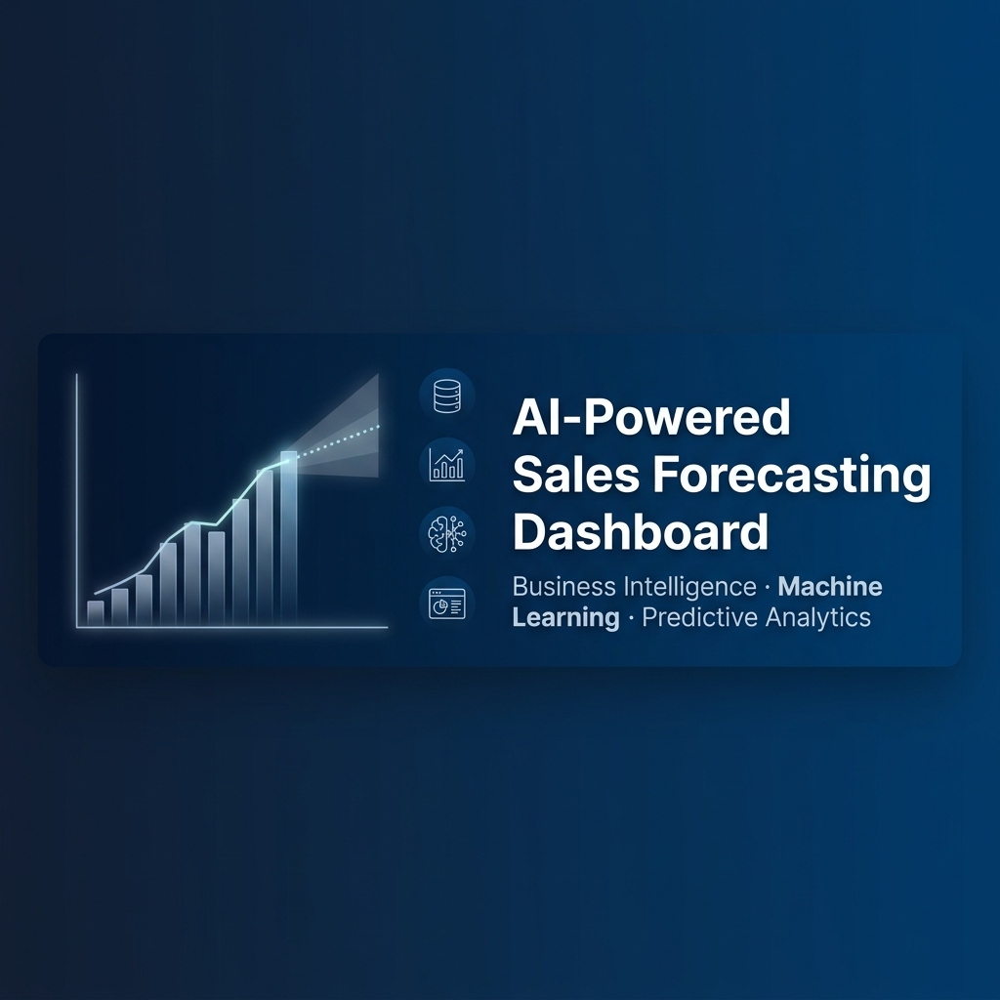
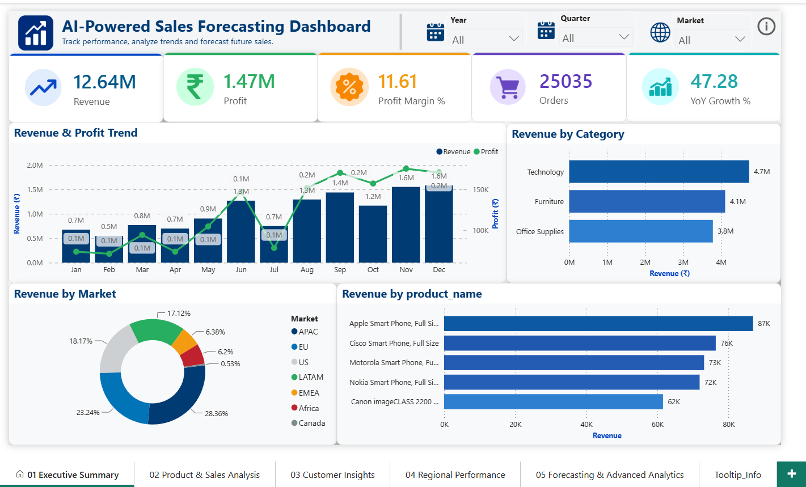
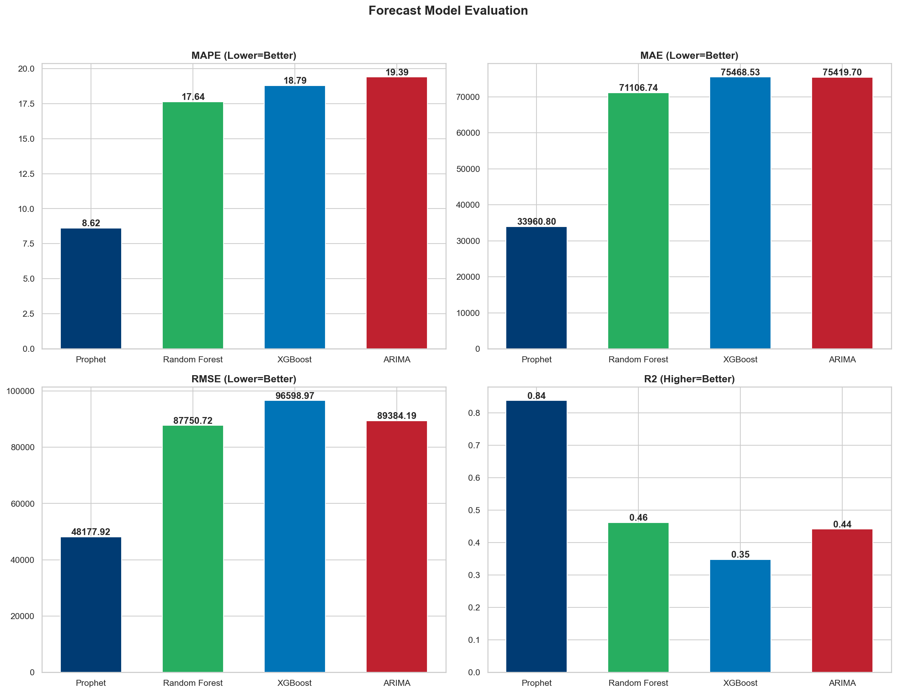
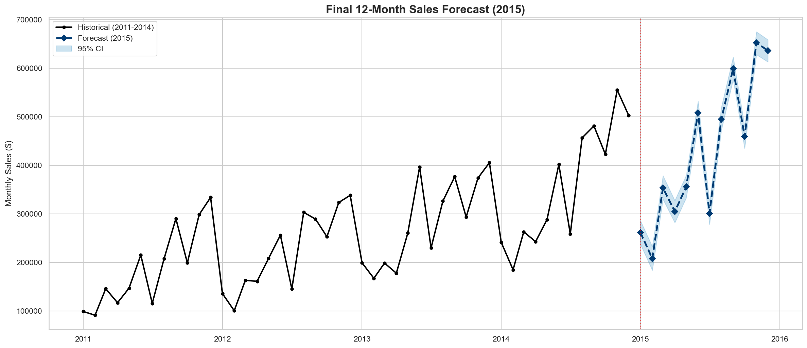
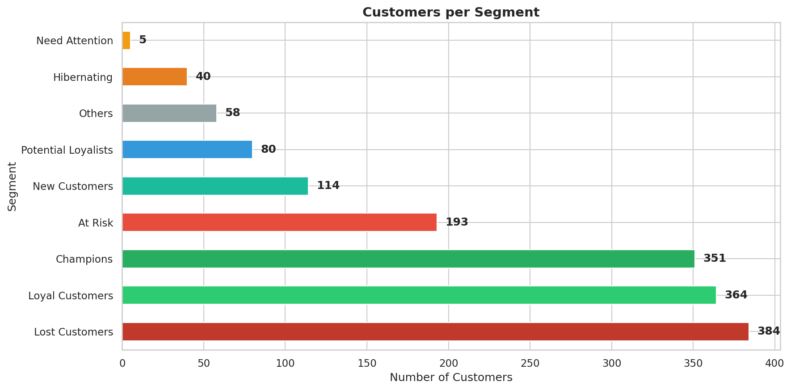
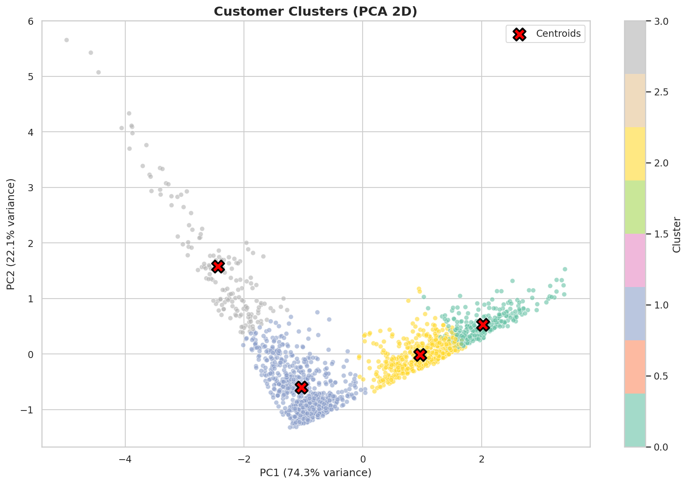

# 🚀 AI-Powered Sales Forecasting Dashboard

<p align="center">
  
</p>

<p align="center">
  <b>Enterprise-Grade Business Intelligence · Machine Learning Forecasting · Interactive Analytics Portal</b>
</p>

<p align="center">
  
  
  
  
  
  
</p>

---

## 📋 Project Status & Phases

| # | Phase | Status | Key Deliverables |
|:---:|:---|:---:|:---|
| 1 | Business Understanding | ✅ Complete | Project charter, KPI framework, data dictionary |
| 2 | Data Prep & Star Schema | ✅ Complete | 51,290 clean rows, 5 normalized tables |
| 3 | SQL Business Analytics | ✅ Complete | 50+ queries (Window Functions, CTEs, Subqueries) |
| 4 | Power BI Dashboard | ✅ Complete | 6 interactive pages, 105 visuals, 30+ DAX measures |
| 5 | Python Advanced Analytics | ✅ Complete | EDA, RFM scoring, K-Means clustering, Market Basket |
| 6 | ML Sales Forecasting | ✅ Complete | Prophet MAPE: **8.62%** (Target <15%) |
| 7 | Streamlit Web App | ✅ Complete | 7-page interactive analytics portal |

---

## 🏆 Headline Results

<table>
<tr>
<td align="center"><b>$12.64M</b><br><sub>Total Revenue</sub></td>
<td align="center"><b>$1.47M</b><br><sub>Total Profit</sub></td>
<td align="center"><b>25,035</b><br><sub>Unique Orders</sub></td>
<td align="center"><b>1,590</b><br><sub>Customers Segmented</sub></td>
<td align="center"><b>8.62%</b><br><sub>Forecast MAPE</sub></td>
<td align="center"><b>$5.14M</b><br><sub>2015 Projected Revenue</sub></td>
</tr>
</table>

---

## 📸 Dashboard & Visualization Showcase

### Power BI Executive Dashboard
<p align="center">
  
</p>

### ML Model Comparison & Sales Forecasting
<p align="center">
  
  
</p>

### Customer Intelligence & RFM Segmentation
<p align="center">
  
  
</p>

---

## 🗄️ Star Schema Data Warehouse

```
                          dim_customer (1,590 rows)
                               │
        dim_product  ───  fact_sales  ───  dim_region
        (10,292 rows)    (51,290 rows)    (147 countries)
                               │
                          dim_date (1,461 days)
```

---

## 🔮 Forecasting Performance

Models validated against a **12-month chronological holdout** (Jan–Dec 2014):

| Forecasting Model | MAPE (%) | R² Score | Status |
|:---|:---:|:---:|:---:|
| 🏆 **Facebook Prophet** | **8.62%** | **0.84** | ✅ **Exceeds Target** |
| Random Forest | 17.64% | 0.46 | ❌ Above threshold |
| XGBoost | 18.79% | 0.35 | ❌ Above threshold |
| ARIMA (SARIMAX) | 19.39% | 0.44 | ❌ Above threshold |

> **2015 Projected Revenue**: **$5,135,726** (+19.44% YoY growth)

---

## 👥 Customer Intelligence

**1,590 customers** segmented via RFM scoring + K-Means clustering:

| Segment | % of Base | Business Action |
|:---|:---:|:---|
| 🏆 Champions | 22.1% | VIP loyalty & exclusive offers |
| 💚 Loyal Customers | 15.0% | Upsell premium products |
| ⚠️ At Risk | 12.1% | Urgent win-back campaigns |
| 🔴 Lost Customers | 24.2% | Automated reactivation emails |

---

## 📁 Repository Structure

```
AI-Powered-Sales-Forecasting-Dashboard/
│
├── 01_Business_Understanding/     # Project charter, KPIs, data dictionary
├── 02_Dataset/                    # Raw → Cleaned → Star Schema datasets
├── 03_SQL/                        # Database scripts & 50+ business queries
├── 04_PowerBI/                    # .pbix report, DAX measures, screenshots
├── 05_Advanced_Analytics/         # 5 notebooks: EDA, RFM, K-Means, Correlation, Basket
├── 06_Machine_Learning/           # 7 notebooks: Prep → ARIMA → Prophet → XGB → RF → Compare → Forecast
│   ├── models/                    # Serialized .pkl model files
│   ├── predictions/               # final_12_month_forecast.csv
│   └── evaluation/                # model_comparison.csv
├── 07_Streamlit_App/              # 7-page interactive web application
│   ├── app.py                     # Portal landing page
│   ├── pages/                     # Dashboard, Sales, Customer, Product, Regional, Forecast, ML
│   └── utils/                     # Shared data_loader, charts, helper modules
├── 08_Documentation/              # Project Report & Technical Guide
├── 09_GitHub_Assets/              # Banner, screenshots, visual showcases
└── requirements.txt               # Python dependency manifest
```

---

## 🛠️ Technology Stack

| Layer | Technologies |
|:---|:---|
| **Database** | MySQL (Star Schema) |
| **BI Tool** | Power BI Desktop (DAX) |
| **Analytics** | Python · Pandas · NumPy · Scipy · Scikit-learn |
| **Forecasting** | Facebook Prophet · XGBoost · Statsmodels ARIMA · Random Forest |
| **Visualization** | Plotly Express · Matplotlib · Seaborn |
| **Web App** | Streamlit (Multi-page) |
| **Version Control** | Git & GitHub |

---

## 🚀 Getting Started

### 1. Clone & Install
```bash
git clone https://github.com/AbhaySharma3666/AI_Powered_Sales_Forecasting_Dashboard.git
cd AI_Powered_Sales_Forecasting_Dashboard
pip install -r requirements.txt
```

### 2. Run Jupyter Notebooks
```bash
jupyter notebook 05_Advanced_Analytics/notebooks/01_EDA.ipynb
jupyter notebook 06_Machine_Learning/notebooks/01_Time_Series_Preparation.ipynb
```

### 3. Launch the Web App
```bash
streamlit run 07_Streamlit_App/app.py
```
Opens at `http://localhost:8501`

---

## 💡 Key Business Recommendations

| # | Insight | Action |
|:---|:---|:---|
| 1 | **Discount-Profit Paradox**: Discounts >20% destroy margins | Cap standard discounts at 20% |
| 2 | **Q4 Seasonality**: 40-60% revenue spike every Q4 | Scale inventory +19.4% by August |
| 3 | **Customer Churn**: 24.2% Lost + 12.1% At Risk | Deploy automated re-engagement campaigns |
| 4 | **Cross-Sell Potential**: Art→Storage, Binders→Paper co-purchases | Implement checkout bundle recommendations |

---

## 📚 Documentation

- 📄 [Project Report](08_Documentation/Project_Report.md) — Comprehensive business & technical analysis
- 🛠️ [Technical Guide](08_Documentation/Technical_Guide.md) — Setup instructions & architecture reference
- 📊 [Power BI README](04_PowerBI/README.md) — Dashboard design & DAX documentation
- 🤖 [ML README](06_Machine_Learning/README.md) — Forecasting methodology & results
- 🌐 [Streamlit README](07_Streamlit_App/README.md) — Web app deployment guide

---

## 📝 License

This project is for **educational and portfolio purposes**.

---

<p align="center">
  <b>Built with ❤️ by Abhay Sharma</b><br>
  <sub>Enterprise Data Analytics · Machine Learning · Full-Stack BI Development</sub>
</p>
